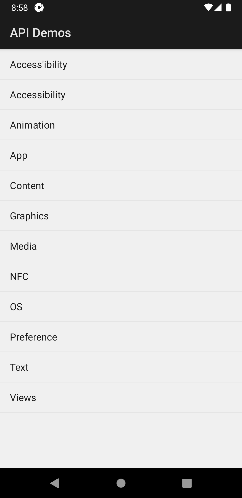
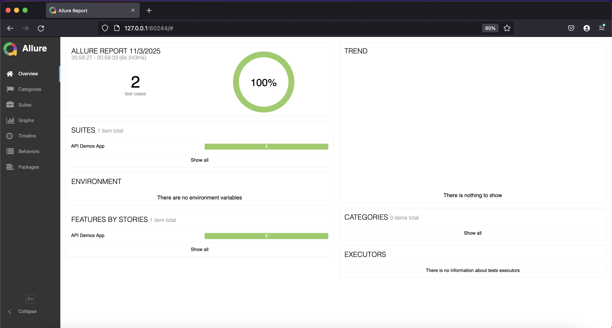
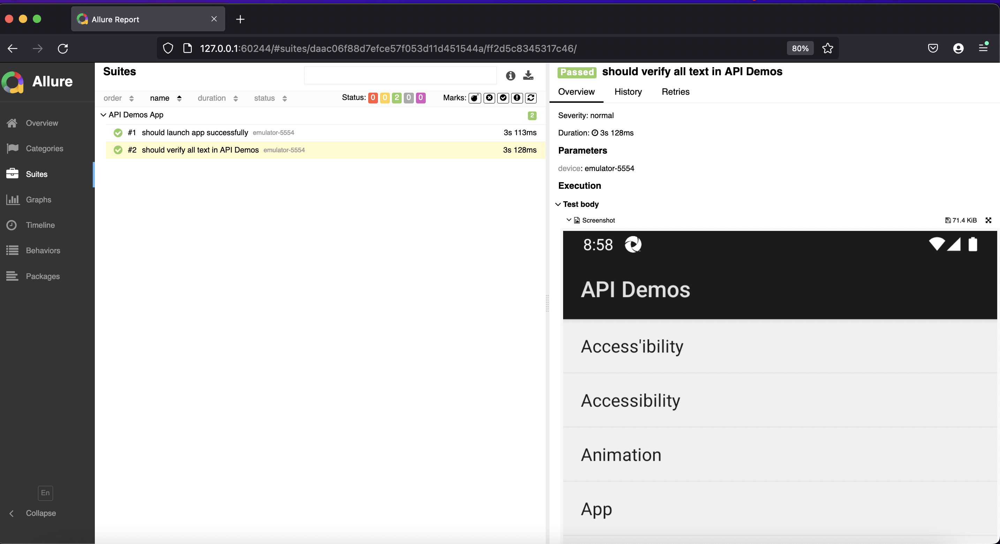

# 📱 API Demos Mobile Tests

Simple Automation Mobile UI Testing project for **Android API Demos App** using **Appium** and **WebDriverIO**.

## 📋 Overview

This project automates end-to-end mobile UI tests for the Android API Demos application, focusing on:

- ✅ App launch functionality validation
- ✅ Text element verification and visibility checks
- ✅ Screenshot capture for test documentation
- ✅ Mobile automation with Android emulator

## 📁 Project Structure

```
appium_mobile_setup/
│
├── test/
│   └── appdemo.test.js                      # API Demos app tests
│
├── report/
│   ├── allure-mobile-test-report.png        # Test report overview
│   └── allure-mobile-test-report-detail.png # Test report detailed view
│
├── allure-results/                          # Allure test results
├── allure-report/                           # Generated Allure reports
│
├── package.json                             # Project metadata & npm scripts
├── package-lock.json
├── wdio.conf.js                            # WebDriverIO configuration
└── README.md                               # Project documentation
```

## ⚙️ Tech Stack

| Tool                 | Purpose                                  |
| :------------------- | :--------------------------------------- |
| **JavaScript (ES6)** | Test scripting language                  |
| **Appium**           | Mobile automation framework              |
| **WebDriverIO**      | Test automation framework                |
| **Mocha**            | Test runner                              |
| **Chai**             | Assertion library                        |
| **Allure**           | Test reporting                           |
| **Node.js + npm**    | Runtime environment & package management |
| **Android Emulator** | Mobile UI execution environment          |

## 🚀 How to Run the Tests

**Clone the repository:**

```bash
git clone <your-repo-url>
cd appium_mobile_setup
```

**Install dependencies:**

```bash
npm install
```

**Start Appium server:**

```bash
appium
```

**Run the tests:**

```bash
npm run test
```

**Generate Allure report:**

```bash
npm run allure:generate
npm run allure:open
```

## 🧪 Test Scenarios

1. **App Launch Test** - Validates successful launch of API Demos app with screenshot
2. **Text Verification Test** - Verifies all main menu text elements are displayed correctly

Each test includes screenshot capture and console logging for test progress tracking.

## 🔧 Test Architecture

### WebDriverIO Configuration

- **Platform**: Android
- **Device**: emulator-5554
- **App Package**: io.appium.android.apis
- **App Activity**: .ApiDemos
- **Automation**: UiAutomator2

### Test Features

- **Element Selection**: XPath selectors for text elements
- **Assertions**: Chai assertions for element visibility
- **Screenshots**: Automatic screenshot capture
- **Reporting**: Allure integration for detailed reports

## 📸 Test Screenshots

Screenshots are automatically captured during test execution and saved as:

- 

## 📊 Test Report

Below is an example of the generated Allure report after running the tests:





## 🧠 Key Learning Points

- Setting up Appium with Android emulator
- Using WebDriverIO with Mocha framework
- Mobile element selection with XPath
- Text element visibility verification
- Screenshot capture for mobile testing
- Allure reporting integration
- Mobile app automation best practices
- Android UI testing with UiAutomator2

## 👩🏻💻 Author

**Elsa Farah Fauzia**  
_Senior Software Quality Assurance_  
📍 Jakarta, Indonesia

🔗 [LinkedIn](https://www.linkedin.com/in/elsafarahfauzia/) | [GitHub](https://github.com/elsafarahhf)
